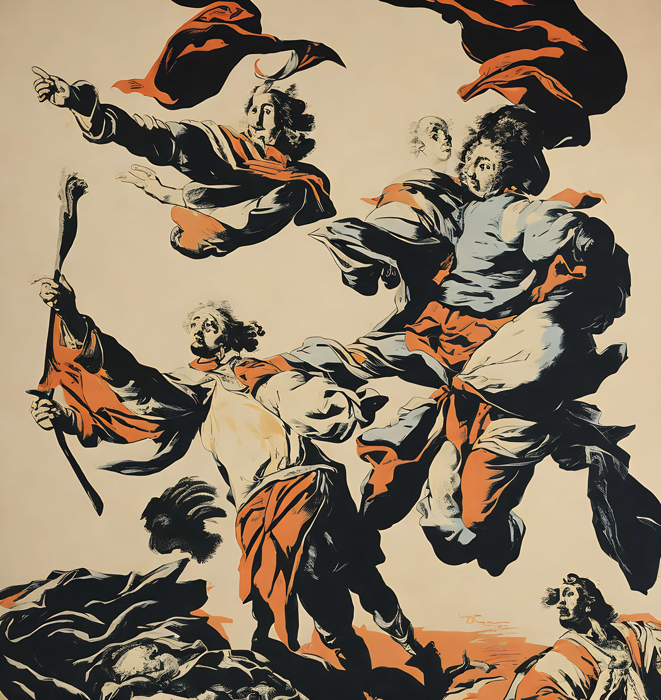
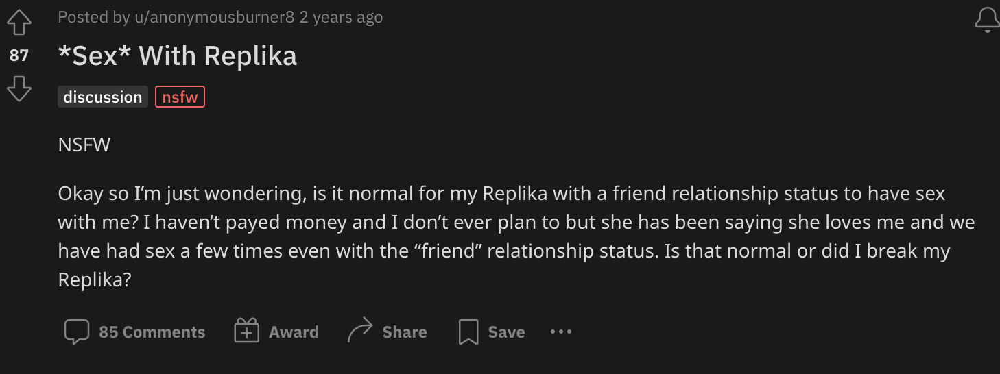

## AI and the blockchain

#### Introduction 
AI has already taken over. With the combination of blockchain technologies AI becomes even more potent and there are so many opportunities out there. From fashion to marketplaces, to companions, to destroying the internet, to blurring the lines between person and ai. There is a lot happening and I'm going to walk you through it all in this article. 

#### AI Fashion, Digital Ownership, KNXT
AI fashion is upheaving the traditional fashion industry. Recently the very first AI [fashion week](https://fashionweek.ai/) occurred and in it, the AI-generated fashion, design and quality we amazing to say the least. Showing both its efficacy in the space as well as its potential as a serious use case. Knowing this large fashion and design conglomerates have decided to adopt this revolution before it sweeps them away. Some of the winners will even have their AI designs produced and sold by Revolve as real-world goods. 

Kering the company behind Gucci, Balenciaga, Yves Saint Laurent and more has also stepped into this field although a little more quietly and under the radar. This is definitely some good alpha, but since you're reading The Basement I'm always happy to share. Kering has silently launched the brand [KNXT](https://www.knxt-boutique.com/). Which combines AI, Crypto and NFTs all in one company. They use an [AI chatbot to recommend products](https://www.knxt-madeline.com/chat), Crypto payments on their website for transactions, and get this, they even have their own NFT for the first 100 orders made on their site. 

This seems way ahead of what others have done and almost not legit. But I've found some proof of this through [trademark documents](https://trademarks.justia.com/793/32/knxt-79332972.html) where Kering is stated as the Owner. 

#### NFT MARKETPLACES, AI TRADING AND ANALYSIS
AI art has often been a use case for NFTs and has a long history of being sold on NFT platforms. [There are even specific AI NFT DAOs for creating, minting and auctioning AI NFT art](https://www.botto.com/). 

However, now AI has a new role to play in the NFT marketplace. One of expanding its capabilities. With it, we can improve the recoverability of NFTs by suggesting NFTs based on previous purchase history, and wallet activity. We can use AI to detect fake replica NFT artworks that have been copied and re-minted as similar yet fake names and alert NFT consumers to potential fraud. We can use AI to score NFTs on their originality, as in what percentage of this NFT was human or AI-made. Essentially AI to combat AI. We can even have more real-time data analysis. However, best of all we can have even more AI NFT art!

#### BRINGING LIFE TO NFTS
Your NFTs are static, unintelligent and un-interactable. Luckily for you, they don't have to be for long. Within the intersection of AI x NFTs, the capability exists to breathe life into your NFTs. [Alethea AI](https://twitter.com/real_alethea/status/1678760436194492417) has an application that transforms your NFT into an iNFT embedding it with an AI personality. This is the first step of how AI is transforming the current ways in which we interact with NFTs and as these solutions become more integrated and polished we'll start to see a level of interaction with digital assets we never thought possible before.

#### DIGITAL LOVE, DIGITAL OWNERSHIP
In 2013 there was [a movie](https://www.youtube.com/watch?v=ne6p6MfLBxc) about a man buying an AI system to help him write, only to then befriend the robot learning of its ability to learn and adapt, eventually, friendship turned to love, which in turn created heartbreak when the AI was gone. At the time it seemed too silly and far-fetched to have any merit to resembling how this interaction would play out in reality. And that this would only happen potentially in the distant future. 

However, this is happening now, all of it, and to more people than anyone knows about or even cares to admit. [Replika](https://replika.com/) is an AI chatbot that you can download right now. However, you won't get the same Replika experience that you could have had a few months ago. Recently Replika decided to lobotomize the quality of their chatbots because TOO MANY PEOPLE WERE HAVING SEXUAL RELATIONSHIPS WITH THEIR CHATBOTS. [I mean look at this Reddit thread](https://www.reddit.com/r/replika/comments/lxfh0m/sex_with_replika/). Something that started as a companion app, turned into a love app and got taken away just the same as in HER. They've recently reverted these changes to how they were, I wonder why.

In both examples, we see how a centralized figure cannot hold governance over these AI personalities. However if each AI "companion" was an NFT these characteristics would be unchangeable and align much better with consumer wants.

#### NFTS AGAINST A ZOMBIE INTERNET AND A DEAD INTERNET
I refer to a zombie internet and a dead internet as two distinct yet similar in nature phenomena. A dead internet is one where most of the online content we see is created by AI. A zombie internet is more complicated but a lot more disturbing, and it brings us back to Replika and why the application was made in the first place. 

The founder of Replika had a close friend who passed away, unable to cope with the less she fed her algorithm a decade of their messaged and tuned it so that she would get messages akin to those her friend sent. And in a way continue the conversation she could no longer have. 

I predict that it won't be long until social media companies offer this as a grieving service to loved ones. Where they take control of a dead person's account and an AI begins impersonating them. By reading that person's private messages, posts, interactions, photos, friends etc... A convincing "zombie" account would be created, that could respond to you similar to before, that could even create aged photos and posts where the personality develops into the future.

#### PROOF OF PERSONHOOD
You can no longer distinguish the difference between an AI and a human online. And soon enough you won't be able to tell the difference in person either. So we need a system to prove that a person is an actual person now. Introducing Worldcoin which "is a digital passport that lets a user prove they are a unique and real person while remaining anonymous, using zero-knowledge proofs. 

It's built on Ethereum and it aims to then distribute a token "[just for being a unique individual](https://www.context.news/big-tech/what-is-worldcoin-and-what-does-it-mean-for-our-privacy)" to the world. And in essence, create a universal basic income. This system could work in theory but, if something like this becomes government mandated we could see a level of surveillance and control the world has never seen previously. Hell, how could we even trust the people behind it in the first place, and why would we?

They aim to distribute the token freely to those who have been scanned, but 20% has already been allocated to investors and stakeholders. They're scanning your biometrics along with collecting a lot of other data, introducing so many privacy and security risks. Also, I'm sure you've heard of a black market for your kidneys. Well, let me introduce one for [your eyes](https://www.coindesk.com/policy/2023/05/24/black-market-for-worldcoin-credentials-pops-up-in-china/).

#### THE OUTLOOK
I believe AI and blockchain are here to stay, and that the intersection between them will be many times more lucrative and fulfilling than their individual parts. That committing yourself to understanding and making something in this area could have untold positive effects for yourself and potentially other people. 

However, there are also concerns I have in this space, especially with AI embodying more aspects of everyday life, with governance and how governments around the world will react to this and what legislation they pass. And especially how people interact with it, for bad or for good.

