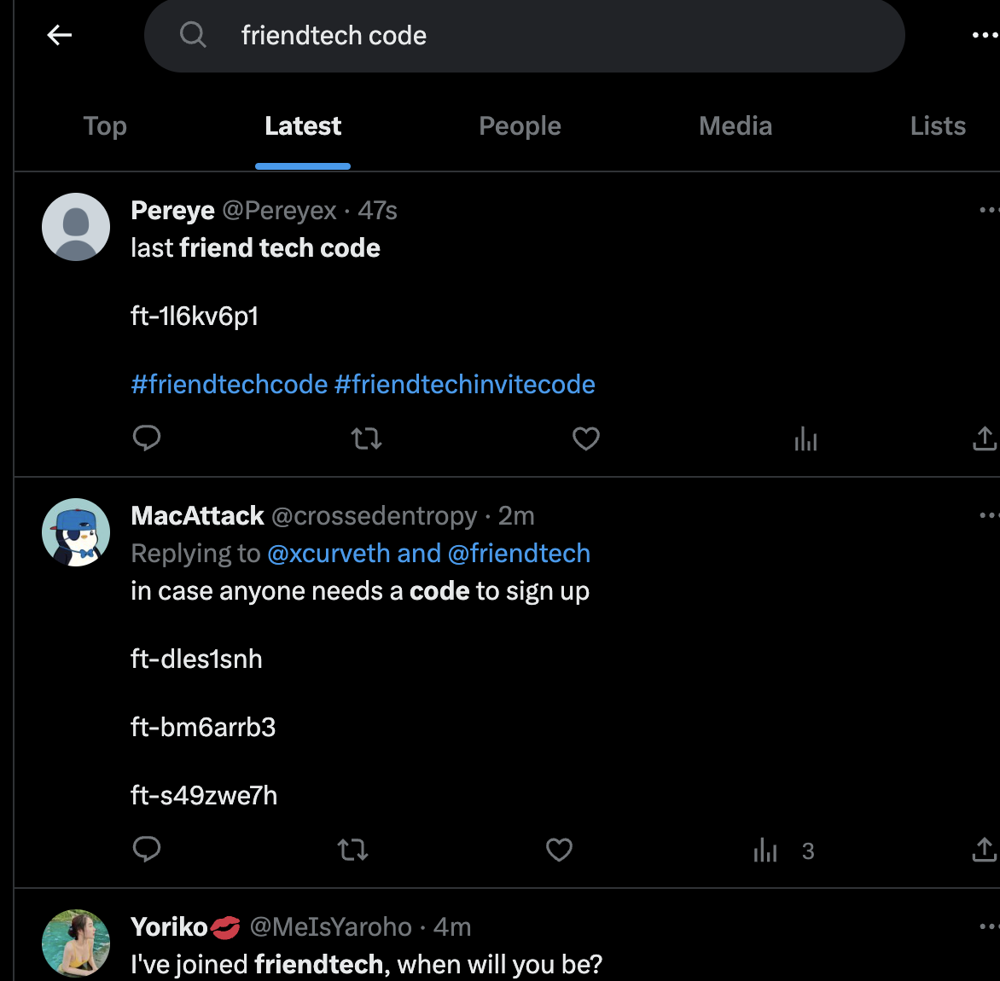
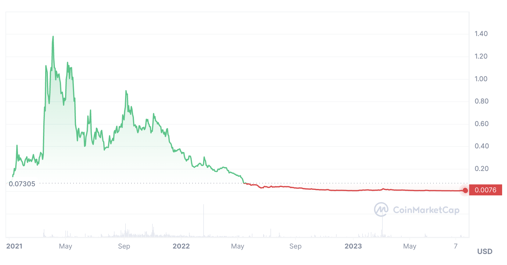
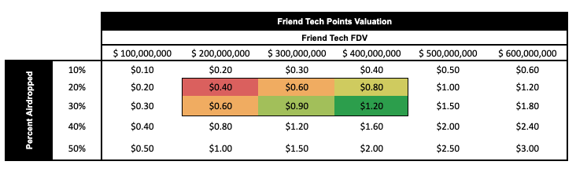

### What is Friend.tech

Your network is your net worth. Theory will only get you so far, so Friendtech is putting it to the test.

Friendtech is a new social token platform that connects your twitter profile with a wallet on Base chain. Users can then buy tokens of yourself that lets them connect directly with you in the app.

To download friend.tech head to [their website](https://www.friend.tech/) on your phone and follow the prompts. Currently, the the app isn't available on the Apple or Play stores. You'll also need an invite code which can be found on [~~Twitter~~ (X)](https://twitter.com/search?q=friendtech%20code&src=typed_query&f=live). After which you will need to deposit some eth, which will be used to buy tokens of other people.

### Social tokens

Social tokens aren't a new concept. They've been tried previously many a time and failed a similar amount of times. They're similar in concept to other tokens like jrny, mvhq, underground. Where you own the token you get access to the thing. The thing here is access to a direct chat with an influencer.

Interestingly, friend tech is similar to platforms such as Roll and Rally, Rally 

Social token platforms challenges
1. Difficulty in growth: One of the biggest obstacles facing social token platforms is their difficulty in scaling. Unlike traditional social media platforms that have millions to billions of users, social token platforms attract much smaller, niche communities. If the platform does not reach the critical mass necessary for sustainability. It will fail
2. Higher barrier of entry: Another hurdle that these platforms face is the relatively high barrier of entry. Facebook, instagram, tiktok, ~~twitter,~~ X are all free to access and use. Social token platforms howvere require a user to invest in tokens to participate fully. This financial requirment can majorly deter potential new users and limit and often cripple growth.
3. Ponzi-like tendencies:

Social token platforms potential
1. Community building

### Legitimacy

### Market Opportunites

There are market opportunities in friend.tech

1. friend.tech app speculation
   1. You can speculate on the growth of the application by buying tokens from high-value influencers that can be used as a proxy metric for the overall app performace
Influencers could include, Racer, Cobie, Haska etc..
2. User speculation
   1. As this mar
3. New user sniping
4. Networking tool
   1. friend.tech allows you to connect with some of the most prominent people in the space fairly easily
   2. use it to leverage your brand
   3. gain useful insights from these closed group chats
5. Airdrop farming
   1. Max out points, more about this later
6. Farming as a chat influencer
   1. Bringing value into the chat incentivises people to buy your tokens
   2. you are rewarded a percentage of transactions of your tokens

### Airdrop

Friend.tech will have an airdrop and it is expected to be quite a substantial one. Airdrop points are distributed weekly, however, gaming points prove difficult as they change the criteria of how to get points weekly.

However, we can speculate on probable ways points are generated each week
- interacting with the app, messaging, buying selling tokens
  - if low on eth you can buy cheap tokens < 0.001
  - to find cheap tokens, search for 

- points distributed every friday

In short 

### Issues

Friend.tech has issues. A lot of which we've seen time and time again with social token platforms. The question is will we fall into the same trap time and time again? Probably, but hopefully not.

Let's list some of the issues
1. Tokens can be botted https://twitter.com/duoxehyon/status/1694410633247420743
2. Influnecers and friend.tech stand to gain the most
3. Influencers can stockpile their own tokens in order to artificially inflate prices only to later dump them on unsuspecting holders
4. The value of the chat is determined by the influencer. If they don't want to add any value, they don't have to
5. You can't determine the quality of the chat before you join. You cannot even see if it's still active or if the influencer is even involved in chatting
6. Retail stands to lose the most
7. Highly volatile
8. Only a certain number of people can hold influencer tokens before it becomes prohibitively expensive
9. These types of platforms have been tried before and failed, which doesn't necessarily mean this will too, but the history is there, be cautious

So clearly some issues, but nothing worthwhile is ever without them. However lots of the issues listed can be fixed to make the platform better, especially in regards to knowing if the chat is being actively maintained by the influencer