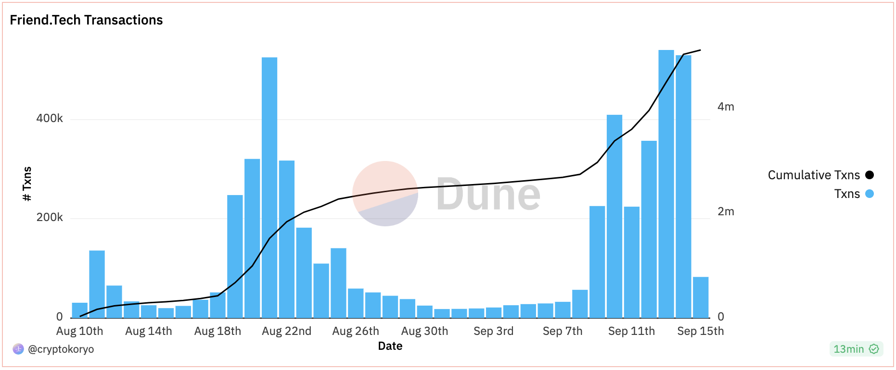

### What is Friend.tech

Your network is your net worth. Theory will only get you so far, so Friendtech is putting it to the test.

Friendtech is a new social token platform that connects your twitter profile with a wallet on Base chain. Users can then buy tokens of yourself that lets them connect directly with you in the app.

To download friend.tech head to [their website](https://www.friend.tech/) on your phone and follow the prompts. Currently, the app isn't available on the Apple or Play stores. You'll also need an invite code which can be found on [~~Twitter~~ (X)](https://twitter.com/search?q=friendtech%20code&src=typed_query&f=live). After which you will need to deposit some eth, which will be used to buy tokens of other people.

<!--  -->

### Social tokens

Social tokens aren't a new concept. They've been tried previously many a time and failed a similar amount of times. They're similar in concept to other tokens like jrny, MVHQ, Underground. Where you own the token you get access to the thing. The thing here is access to a direct chat with an influencer.

Interestingly, friend tech is similar to platforms such as Roll and Rally, Rally 

Social token platform challenges
1. Difficulty in growth: One of the biggest obstacles facing social token platforms is their difficulty in scaling. Unlike traditional social media platforms that have millions to billions of users, social token platforms attract much smaller, niche communities. If the platform does not reach the critical mass necessary for sustainability. It will fail
2. Higher barrier of entry: Another hurdle that these platforms face is the relatively high barrier of entry. Facebook, Instagram, TikTok, ~~twitter,~~ X are all free to access and use. Social token platforms however require a user to invest in tokens to participate fully. This financial requirement can majorly deter potential new users and limit and often cripple growth.
3. Ponzi-like tendencies:

Social token platform potential
1. A more intimate community-building opportunity for influencers, to connect and interact with their most loyal fans. Creating tangible benefits for their audience, and similarly allowing fans to get close interaction with their preferred influencers.
2. Leveraging the community to be part of governance mechanisms and generally encouraging user participation through airdrops and the like, could boost the popularity of the platform, and see a newer type of social media where the user has a lot more control and influence

### Legitimacy

friend.tech is backed by [Paradigm](https://pitchbook.com/profiles/company/534396-16#funding) a massive investment firm that's invested in the likes of opensea, blur, coinbase and many more. So it has investment credibility. And it has garnered user credibility quite quickly too, with a widespread adoption with the crypto community. It has not broached much further with the exception of the OnlyFans models.

Lots of larger influencers are already taking full advantage of the ecosystem and leveraging their existing userbase on the platform. And by interacting regurarly with them and luring other users to buy their keys they are able to generate some revenue for themselves through the 5% fee that they recieve from each transaction

Lots of larger influencers are already taking full advantage of the ecosystem

Widespread adoption in the market, however 

### Market Opportunites

There are some market opportunities in friend.tech, however not without risk. More opportunities do exist if you have an existing social presence or fan base. As a result, even OnlyFans models have been leveraging the platform to facilitate private chats with their fans. However, this doesn't come as a surprise as they have always been the truest form of hustlers on these streets.

1. friend.tech app speculation
   - You can speculate on the growth of the application by buying tokens from high-value influencers that can be used as a proxy metric for the overall app performance Influencers could include, Racer, Cobie, Haska etc..
2. User speculation
   - As this mar
3. New user sniping
   - Be on the lookout for new users joining the platform who already have an established following. If you manage to buy their keys very quickly you can buy at a massive discount. There are [discord communities](https://discord.gg/NJY8tkNa2Z) that give you live feeds of new users joining so you can be updated in real time. However the reality is this technique is heavily botted, and it might be better to employ your bot rather than gruel through the manual process.
4. Networking tool
   - friend.tech allows you to connect with some of the most prominent people in the space fairly easily
   - use it to leverage your brand
   - gain useful insights from these closed group chats
5. Airdrop farming
   - Max out points, more about this later
6. Farming as a chat influencer
   - Bringing value into the chat incentivises people to buy your tokens
   - you are rewarded a percentage of transactions of your tokens

friend.tech has been lucrative for some of the best traders, however the competition is fierce and dominated by bots. However these traders should still see some more upside from the upcoming airdrop

Influencers themselves seem to be generating a large amount of money for themselves too, with a lot less risk than the traders had put up.

### Airdrop

Like fly's to honey, wherever there is an airdrop there are sure to be crypto degens too. It's a large part of the attraction of friend.tech, airdrop farmers trying to grow their crops for harvest.

And it's also expected that this airdrop will be quite a substantial one. Airdrop points are distributed weekly, however, gaming points prove difficult as they change the criteria of how to get points weekly.

Although we can't guarantee the exact method that would grant the most points week by week, we can speculate on what should garner points.

These could include
- Buying and selling keys
  - weighted by key values
- Messaging
- App activity
  - this could also be a slight multiplier for other point metrics
- Using invite codes
  - if you don't have anyone to share them with, post them on twitter with a burner account
- Holding keys
  - weighted by key values

These points are distributed every friday, and in short the below table was created by axsn who did a [solid writeup](https://twitter.com/asxn_r/status/1693280773237805400) into the potential value of the airdrop

### Issues

Friend.tech has issues. A lot of which we've seen time and time again with social token platforms. The question is will we fall into the same trap time and time again? Probably, but hopefully not.

Let's list some of the issues
1. [Tokens can be botted](https://twitter.com/duoxehyon/status/1694410633247420743)
2. Influnecers and friend.tech stand to gain the most
3. Influencers can stockpile their own tokens in order to artificially inflate prices only to later dump them on unsuspecting holders
4. The value of the chat is determined by the influencer. If they don't want to add any value, they don't have to
5. You can't determine the quality of the chat before you join. You cannot even see if it's still active or if the influencer is even involved in chatting
6. Retail stands to lose the most
7. Highly volatile
8. Only a certain number of people can hold influencer tokens before it becomes prohibitively expensive
9. These types of platforms have been tried before and failed, which doesn't necessarily mean this will too, but the history is there, be cautious
10. Post airdrop dump: As lots of users are only using friend.tech to farm airdrop points and not for the actual platform itself, after the airdrop is distributed we could see a massive layoff of keys and a sharp decline in prices and opposite increase in volatility

So clearly some major issues, but nothing worthwhile is ever without them. However, lots of the issues listed can be fixed to make the platform better, especially in regards to knowing if the chat is being actively maintained by the influencer