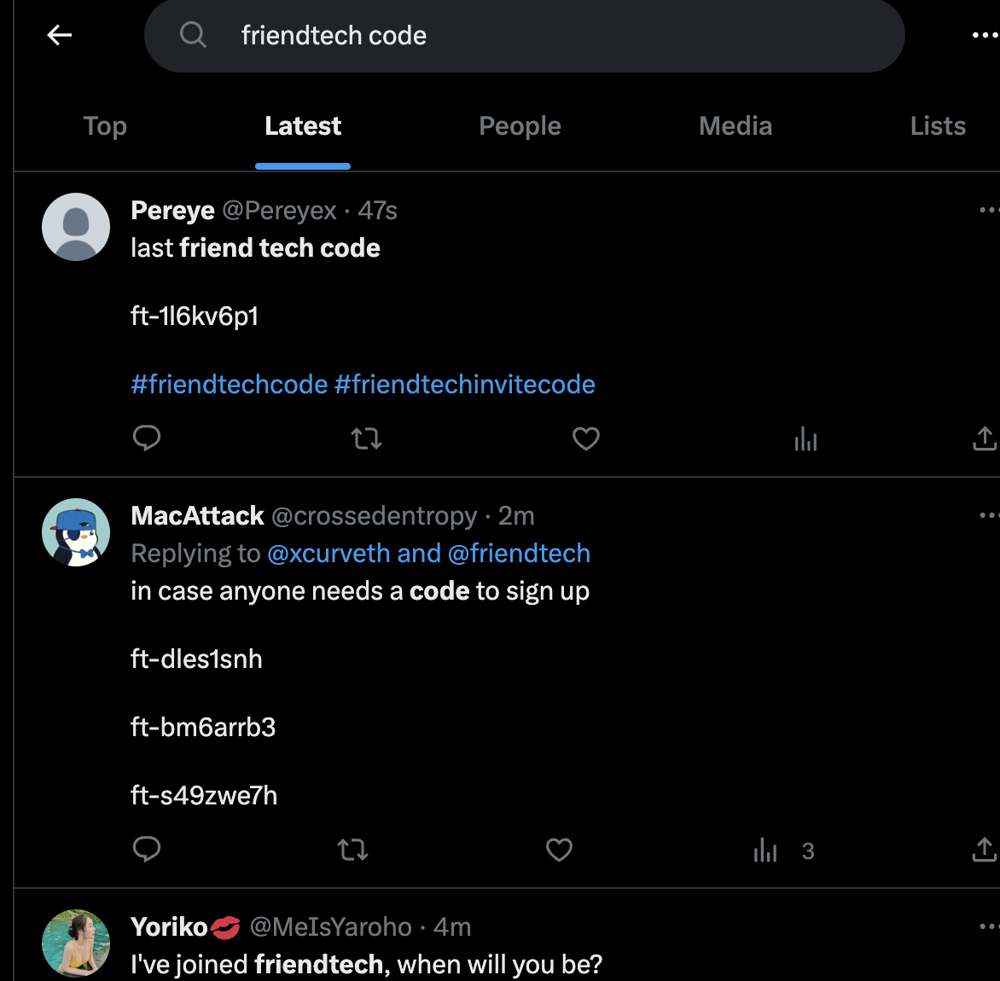

### What is Friend.tech

Your network is your net worth. Theory will only get you so far, so Friendtech is putting it to the test.

Friendtech is a new social token platform that connects your twitter profile with a wallet on Base chain. Users can then buy tokens of yourself that lets them connect directly with you in the app.

To download friend.tech head to [their website](https://www.friend.tech/) on your phone and follow the prompts. Currently, the the app isn't available on the Apple or Play stores. You'll also need an invite code which can be found on [~~Twitter~~ (X)](https://twitter.com/search?q=friendtech%20code&src=typed_query&f=live). After which you will need to deposit some eth, which will be used to buy tokens of other people.

### Social tokens

Social tokens aren't a new concept.

### Legitimacy

### Market Opportunites

--- Speculating on growth of the overall app

--- Looking for big new users joining buy their token early

--- Networking, exclusive access

--- Airdrop

### Airdrop

- points distributed weekly
- they change the criteria of how to get weekly so it's harder to game
- interacting with the app generates points
- sharing codes generates points
- 

### Issues