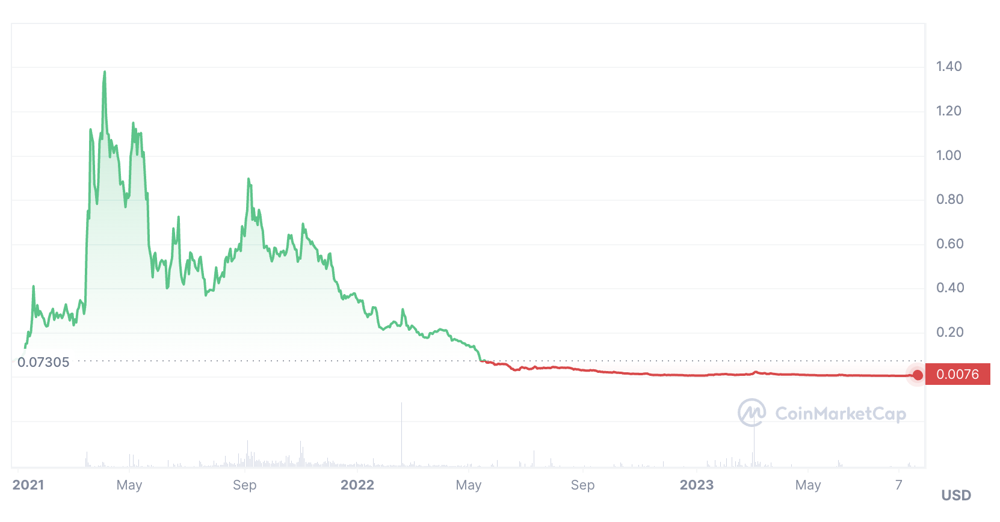

### What is Friend.tech

Your network is your net worth. 

- new social platform that connects your twitter to a wallet on base chain
- users can buy tokens of other users
- tokens give you access to an exclusive chat
- tokens become exponentially more expensive the more people buy them
- theres no Apple or Android app
- download from the website https://www.friend.tech/
  - follow prompts
- you need a code, get it from ~~twitter~~ X
  - easy search https://twitter.com/search?q=friendtech%20code&src=typed_query&f=live 
- you need to deposit eth, get it from your wallet
- they take 5% in fees, another 5% goes to the influencer

### Social tokens

- social tokens arent new
  - similar in principle to whale, jrny, mvhq, underground tokens, you own the token you get access to the thing
  - the thing here is a chat with the influencer
  - similar to other platfroms roll, rally
    - rally is gone, it sucked
    - here's a chart
    - 
    - social token platforms fail because
      - they are hard to grow
      - higher barrier of entry, other social platforms are free
      - very ponzi
    - social token platforms could work if
      - i'm an influencer and you give me money

### Legitimacy

- backed by paradigm https://pitchbook.com/profiles/company/534396-16#funding
- lots of bigger influencers are on there
  - even bitches like beanie
- lots of users, although recent hype seems to have fallen off https://dune.com/cryptokoryo/friendtech
  - 
### Market Opportunites

- speculating on the growth of the app 
  - buy token of higher value influencers that can be used as proxy metrics for app performance
  - racer (behind friendtech)
  - cobie
  - haska
- new users
  - look out for new users joining the platform who have a lot of followers
  - when a new user joins the platform their price starts of the same as everyone else's, close to 0
  - if you can buy their token quickly you could sell afterwards when more people are aware
  - you can join a group like this https://discord.gg/NJY8tkNa2Z that has feeds for new users, and turn on notis for the higher follower count accounts
  - get your bot to do this
    - alternatively, coerce a botter
- use it for networking
  - this app allows you to connect with some of the most prominent people fairly easily
  - use it to leverage your own brand
  - tell them to go fuck themselves and sell your token if you want
- airdrop
  - max out your points, more on this below
- simp boys can get in contact with their favourite Onlyfans girls
  - no need to dm them on twitter anymore
  - instant feet pic service gaurenteed 
  - potentially a cheaper more direct OF without the monthly subscripts, wow that's real value for money

### Airdrop

- points distributed weekly
- they change the criteria of how to get weekly so it's harder to game
- interacting with the app probably generates points
- buying and selling tokens probably generates points
  - low on eth? buy cheap tokens < 0.001
  - to find cheap tokens, search for a random user like "bob" and find an account with a small amount of holders
- sharing codes probably generates points
  - don't know who to share with? post the codes on twitter with an alt
- speculated return on points
  - axsn did a solid writeup https://twitter.com/asxn_r/status/1693280773237805400
  - in short 

### Issues

- tokens can be botted https://twitter.com/duoxehyon/status/1694410633247420743
- influncers and friendtech stand to gain the most
- influencers can stockpile their own token to inflate prices and dump on holders later
- value of chat is determined by the influecner. If they don't want to chat they don't 
  - you can't determine the quality of the chat before you join the chat
- retaill stands to lose the most
- highly volatile
- only a certain amount of people can hold influencer tokens before it gets too expensive
- these types of platforms have been tried before and failed, which doesn't necessarily mean this will too, but be cautious